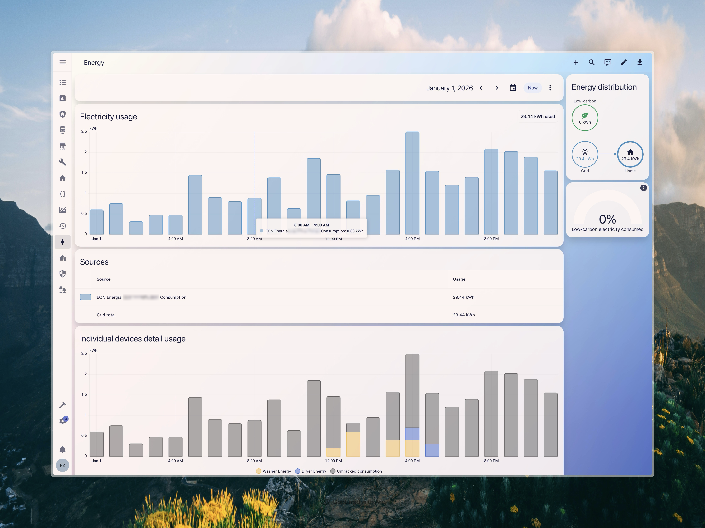

<p align="center">
  
</p>

<h1 align="center">E.ON Energia for Home Assistant</h1>

<p align="center">
  Your hourly electricity readings, in the Energy Dashboard.<br>
  Costs come from your own invoices, not an assumed tariff.
</p>

<p align="center">
  <a href="https://my.home-assistant.io/redirect/hacs_repository/?owner=FezVrasta&repository=eon-energia-italia-hass&category=integration">
    
  </a>
</p>

<p align="center">
  
  
  
  
</p>

---

E.ON's app shows you yesterday's electricity, hour by hour. Home Assistant's Energy Dashboard can show the same numbers next to everything else in the house, but nothing puts them there. This does, and it prices them from the invoices E.ON has actually issued you rather than a tariff you typed in once.

## Features

- **Simple Login**: Just enter your EON Energia email and password
- **Automatic Statistics Import**: Hourly consumption data is automatically imported to HA statistics
- **Energy Dashboard Ready**: Works directly with the Home Assistant Energy Dashboard
- **Cumulative Energy Sensors**: Track total consumption with persistent state across restarts
- **Daily Energy Consumption Sensor**: Total daily kWh consumption
- **Last Hourly Reading Sensor**: Most recent hourly reading with timestamp
- **Hourly Breakdown**: All 24 hourly readings available as sensor attributes
- **Historical Data Import**: Import up to 365 days of historical consumption data via service
- **Tariff Support**: Choose between Monoraria (single rate) or Bioraria/Multioraria (F1, F2, F3)
- **Invoice Tracking**: Monitor invoices, payment status, and costs
- **Cost Statistics**: Automatic cost calculation from average €/kWh (calculated from invoices)
- **Connection Status Sensor**: Monitor the health of your API connection
- **Italian and English translations**



## Installation

### HACS (Recommended)

1. Open HACS in Home Assistant
2. Click on "Integrations"
3. Click the three dots menu in the top right corner
4. Select "Custom repositories"
5. Add `https://github.com/fezvrasta/eon-energia-italia-hass` as a custom repository (Category: Integration)
6. Search for "EON Energia Italia" and install
7. Restart Home Assistant

### Manual Installation

1. Download the latest release from [GitHub Releases](https://github.com/fezvrasta/eon-energia-italia-hass/releases)
2. Copy the `custom_components/eon_energia` folder to your Home Assistant `custom_components` directory
3. Restart Home Assistant

## Configuration

1. Go to **Settings** → **Devices & Services** → **Add Integration**
2. Search for "EON Energia"
3. Enter your EON Energia email and password
4. Select your electricity meter (POD) if you have multiple
5. Choose your tariff type (Monoraria or Bioraria/Multioraria)

## Sensors

### Cumulative Energy

- **Entity ID**: `sensor.eon_energia_PODID_cumulative_energy`
- **Unit**: kWh
- **State Class**: `total`
- **Description**: Running total of energy consumption since integration setup. Persists across restarts.
- **Attributes**:
  - `pod`: Your POD code
  - `last_processed_date`: Last date that was added to the total
  - `statistic_id`: The external statistic ID for Energy Dashboard

For Bioraria/Multioraria tariffs, additional cumulative sensors are created:

- `sensor.eon_energia_PODID_cumulative_energy_peak_f1` - Peak hours (F1)
- `sensor.eon_energia_PODID_cumulative_energy_mid_peak_f2` - Mid-peak hours (F2)
- `sensor.eon_energia_PODID_cumulative_energy_off_peak_f3` - Off-peak hours (F3)

### Daily Consumption

- **Entity ID**: `sensor.eon_energia_PODID_daily_consumption`
- **Unit**: kWh
- **State Class**: `total_increasing`
- **Description**: Total consumption for the most recent available day.
- **Attributes**:
  - `pod`: Your POD code
  - `data_date`: Date of the readings
  - `hourly_breakdown`: Dictionary with all 24 hourly readings

### Last Hourly Reading

- **Entity ID**: `sensor.eon_energia_PODID_last_reading`
- **Unit**: kWh
- **Description**: Most recent hourly reading value.
- **Attributes**:
  - `reading_hour`: Hour of the reading (e.g., "14:00")
  - `reading_date`: Date of the reading

### Token Status

- **Entity ID**: `sensor.eon_energia_PODID_token_status`
- **Category**: Diagnostic
- **Description**: Shows the current status of the API connection (`valid`, `invalid`, or `unknown`).
- **Attributes**:
  - `pod`: Your POD code
  - `last_error`: Error message if the last update failed

### Latest Invoice

- **Entity ID**: `sensor.eon_energia_PODID_latest_invoice`
- **Unit**: €
- **Description**: The amount of the most recent invoice.
- **Attributes**:
  - `pod`: Your POD code
  - `invoice_number`: Invoice document number
  - `issue_date`: Date the invoice was issued
  - `due_date`: Payment due date
  - `payment_status`: Current payment status
  - `amount_paid`: Amount already paid
  - `amount_remaining`: Remaining amount to pay
  - `billing_period_start`: Start of the billing period
  - `billing_period_end`: End of the billing period
  - `pod_amount`: Amount specific to this POD (for multi-POD invoices)

### Invoice Payment Status

- **Entity ID**: `sensor.eon_energia_PODID_invoice_payment_status`
- **Description**: Payment status of the latest invoice (`paid`, `unpaid`, or `partial`).
- **Attributes**:
  - `pod`: Your POD code
  - `invoice_number`: Invoice document number
  - `due_date`: Payment due date
  - `total_amount`: Total invoice amount
  - `amount_paid`: Amount already paid
  - `amount_remaining`: Remaining amount to pay
  - `raw_status`: Original status from API

### Unpaid Invoices

- **Entity ID**: `sensor.eon_energia_PODID_unpaid_invoices`
- **Unit**: €
- **Description**: Total amount of unpaid invoices.
- **Attributes**:
  - `pod`: Your POD code
  - `unpaid_count`: Number of unpaid invoices
  - `unpaid_invoices`: List of unpaid invoices with details

### Total Invoiced

- **Entity ID**: `sensor.eon_energia_PODID_total_invoiced`
- **Unit**: €
- **State Class**: `total`
- **Description**: Running total of all invoiced amounts for this POD. Persists across restarts.
- **Attributes**:
  - `pod`: Your POD code
  - `invoice_count`: Number of processed invoices
  - `processed_invoice_numbers`: List of all processed invoice numbers

## Services

### Import Historical Statistics

Import historical energy consumption data into Home Assistant statistics for use in the Energy Dashboard.

> **Note**: New data is automatically imported every 6 hours. This service is only needed to backfill historical data when you first set up the integration.

**Service**: `eon_energia.import_statistics`

**Parameters**:

- `days` (optional): Number of days to import (1-365, default: 90)

**Example**:

```yaml
service: eon_energia.import_statistics
data:
  days: 90
```

**External Statistics** (for Energy Dashboard):

- **Total Consumption**: `eon_energia:{POD}_consumption`
- **F1 Peak Hours**: `eon_energia:{POD}_consumption_f1` (Bioraria/Multioraria only)
- **F2 Mid-Peak Hours**: `eon_energia:{POD}_consumption_f2` (Bioraria/Multioraria only)
- **F3 Off-Peak Hours**: `eon_energia:{POD}_consumption_f3` (Bioraria/Multioraria only)
- **Cost**: `eon_energia:{POD}_cost` (automatically imported from invoices)

## Tariff Types

### Monoraria

Single tariff rate - same price all day. Only total consumption statistics are created.

### Bioraria/Multioraria

Multiple tariff rates with different prices based on time of day:

- **F1 (Peak)**: Monday-Friday 8:00-19:00
- **F2 (Mid-Peak)**: Monday-Friday 7:00-8:00 and 19:00-23:00, Saturday 7:00-23:00
- **F3 (Off-Peak)**: Nights 23:00-7:00, Sundays, and holidays

## Energy Dashboard

To add EON Energia consumption to the Energy Dashboard:

1. Go to **Settings** → **Dashboards** → **Energy**
2. Click **Add Consumption**
3. Search for "eon" and select the consumption statistic you want to track
4. Save

## API Information

This integration uses the EON Energia API:

- **Base URL**: Fetched dynamically from the EON website
- **Consumption Endpoint**: `/DeeperConsumption/v1.0/ExtDailyConsumption`
- **Invoices Endpoint**: `/scsi/invoices/v1.0/getInvoiceDvc`
- **Consumption Update Interval**: Every 6 hours
- **Invoice Update Interval**: Every 24 hours

## Troubleshooting

### Connection issues

If the **Connection Status** sensor shows errors or you're having trouble fetching data:

1. Go to **Settings** → **Devices & Services** → **EON Energia**
2. Click **Configure** (or use the three-dot menu → Reconfigure)
3. Enter your EON Energia credentials again to reconnect

### No data

Energy data is typically available with a 2-day delay. The integration automatically fetches the most recent available data (checking up to 7 days back).

### Empty response

If the API returns empty data, the readings for that date haven't been processed yet by EON Energia.

### Historical data not showing in Energy Dashboard

1. First, run the `eon_energia.import_statistics` service to backfill historical data
2. Go to **Developer Tools** → **Statistics** and search for "eon" to verify the data was imported
3. Add the external statistic (e.g., `eon_energia:{POD}_consumption`) to your Energy Dashboard

### Connection Status shows "invalid"

Check the Connection Status sensor's `last_error` attribute for details. Common causes:

- Network connectivity issues
- EON Energia API temporarily unavailable
- Session expired (use Configure/Reconfigure to log in again)

## Limitations

- **Electricity only**: This integration currently supports electricity meters (POD) only. Gas meter (PDR) support is not implemented as I don't have a gas contract to test with. If you have an EON gas contract and would like to help add support, please open an issue on GitHub.

## Contributing

Contributions are welcome! Please feel free to submit a Pull Request.

## License

This project is licensed under the MIT License - see the [LICENSE](LICENSE) file for details.

## Legal notice

**Unofficial.** Not affiliated with, authorised by or endorsed by E.ON Energia S.p.A. "E.ON" and the E.ON logo are their trade marks, used here only to identify whose service this talks to, which is referential use under Article 14(1)(c) of Regulation (EU) 2017/1001. The files in `custom_components/eon_energia/brand/` are E.ON's artwork, reproduced so Home Assistant can label the integration.

**What it does.** Signs in to E.ON's own API with credentials you supply, for an account you hold, and reads that account's consumption and billing data. It does not write, order, or change anything, and it makes fewer requests than the official app. No attempt is made to reach any account but your own, to circumvent authentication or rate limiting, or to defeat a technological protection measure.

**Why this is allowed.** It is an independently created program interoperating with an existing one, which Articles 5(3) and 6 of Directive 2009/24/EC permit (in Italy, Articles 64-ter and 64-quater of Legge 633/1941); Article 8 makes contract terms purporting to remove the Article 5(3) right void. The data it retrieves is your own, which you are entitled to under Articles 15 and 20 GDPR, Articles 23 and 24 of Directive (EU) 2019/944 on the internal electricity market, and Chapter II of the Data Act (Regulation (EU) 2023/2854).

**API configuration.** E.ON publish their API base URL and APIM subscription key in JavaScript on their public login page; the integration reads them from there at runtime and keeps an encrypted copy as a fallback. That encryption is obfuscation, not secrecy, and `api_config.py` says so. They are not anyone's credentials.

None of the above is legal advice. No warranty; MIT licensed; use at your own risk, and you remain bound by your contract with E.ON. If E.ON consider anything here to infringe, open an issue and it will be addressed.

## Credits

Developed by [@fezvrasta](https://github.com/fezvrasta)
